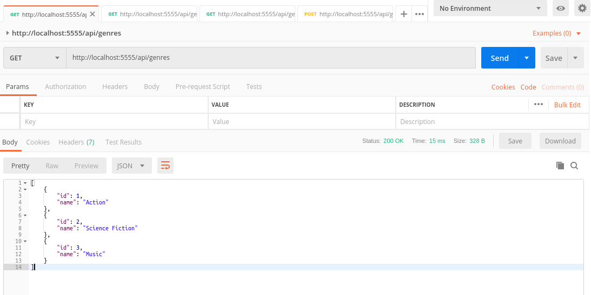
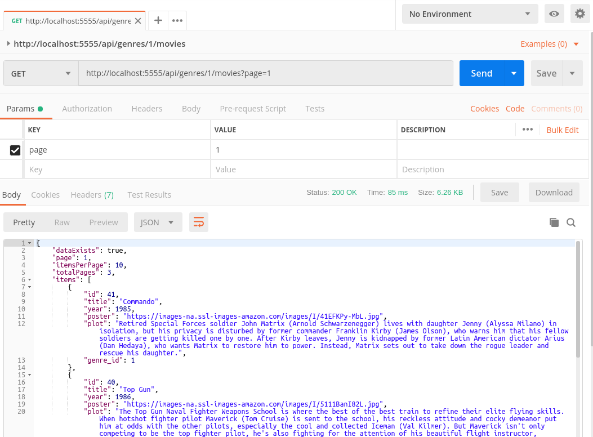
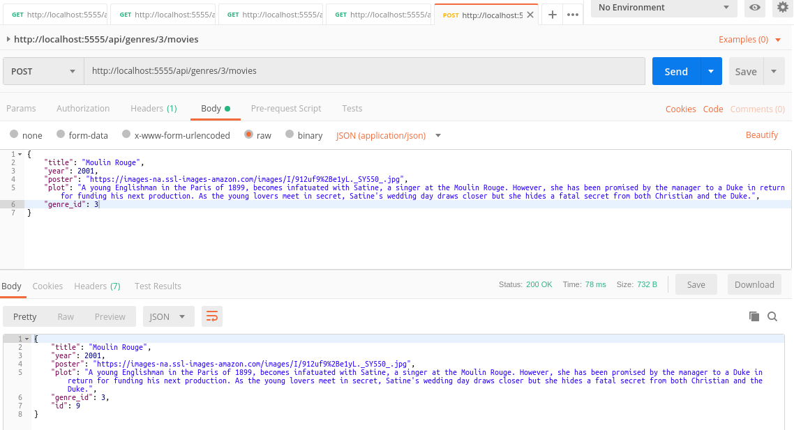

MOVIES REST API WITH NODE AND EXPRESS
--------------------------------------------------------------------------------------------------------------------

**API Rest desarrollada con Node y Express.**

**Se utilizan librerias node-postgres y knex para conectarse y almacenar datos en un servidor PostgreSQL**

--------------------------------------------------------------------------------------------------------------------

**Ejecución de API con Postman**

Pantalla que muestra retorno de endpoint genres:

Pantalla que muestra retorno de endpoint movies by genre con paginación y ordenamiento:

Pantalla que muestra endpoint que permite agregar movies by genre:

--------------------------------------------------------------------------------------------------------------------