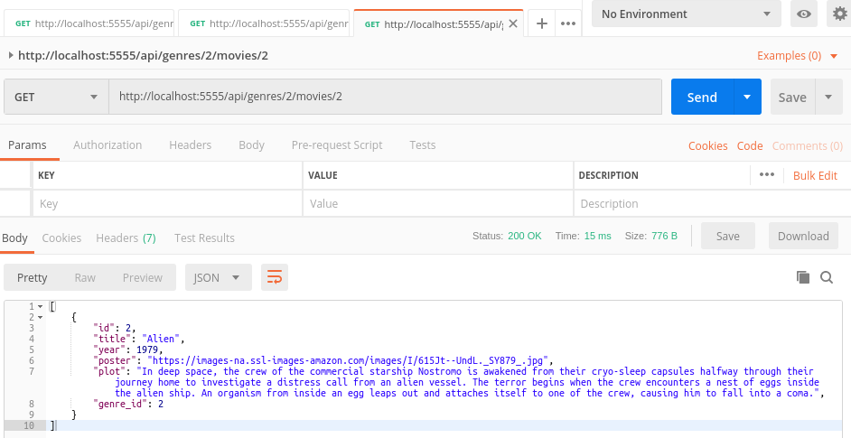

MOVIES REST API
------------------------------------------------------------------------------------------------------------

Rest API developed with Node and Express.

Libraries node-postgres and knex are used to connect and store data in a PostgreSQL database.

This app contains endpoints that allows to store data about movies and genres.

------------------------------------------------------------------------------------------------------------

Dependencies used by the app:

```

  "dependencies": {
    "cors": "^2.8.5",
    "dotenv": "^8.1.0",
    "express": "^4.17.1",
    "knex": "^0.19.5",
    "pg": "^7.12.1"
  },
  "devDependencies": {
    "nodemon": "^1.19.2"
  }

```

------------------------------------------------------------------------------------------------------------

**Call to retrieve genres from Postman:**


------------------------------------------------------------------------------------------------------------

**Get call to retrive movies by genre from Postman:**


------------------------------------------------------------------------------------------------------------

**Get call to retrieve a movie by id from Postman:**



------------------------------------------------------------------------------------------------------------

**Post call to store a movie from Postman:**


------------------------------------------------------------------------------------------------------------