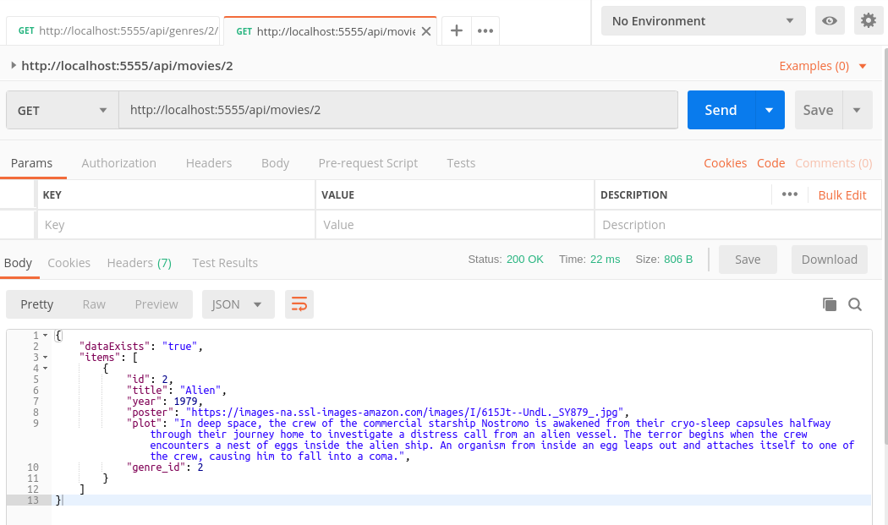

MOVIES REST API WITH NODE AND EXPRESS
--------------------------------------------------------------------------------------------------------------------

**API Rest desarrollada con Node y Express.**

**Se utilizan librerias node-postgres y knex para conectarse y almacenar datos en un servidor PostgreSQL**

--------------------------------------------------------------------------------------------------------------------

Esta aplicación contiene servicios Rest que permiten manipular información de películas que son utilizados
por la aplicación "IONIC MOVIES APP", desarrollada con Ionic 4.

**IONIC MOVIES APP**

https://github.com/edgar-code-repository/ionic-movies-app

--------------------------------------------------------------------------------------------------------------------

**Ejecución de API con Postman**

**Pantalla que muestra retorno de endpoint genres:**

**Pantalla que muestra retorno de endpoint movies by genre con paginación y ordenamiento:**

**Pantalla que muestra endpoint que permite recuperar movie by id:**

**Pantalla que muestra endpoint que permite agregar movies by genre:**

--------------------------------------------------------------------------------------------------------------------